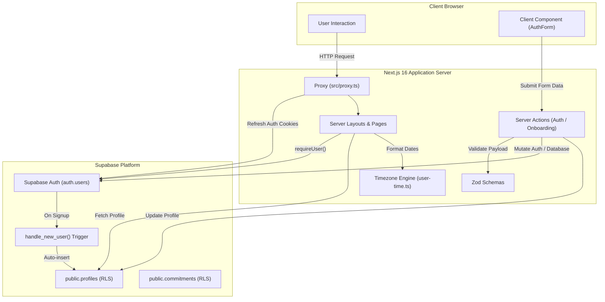

# PACT

**Keep your word to yourself.**

PACT is a personal operating system designed for self-discipline, follow-through, and financial clarity. Built around the daily loop of *plan, commit, execute, measure, learn, and improve*, PACT replaces noisy, vanity-driven productivity trackers with an intentional, quiet environment grounded in accountability.

---

## Overview

Most productivity applications create friction through cluttered dashboards, arbitrary gamification, or overwhelming configuration. PACT takes the opposite approach:

* **Intentional commitments**: Focus on promises with concrete deadlines and private consequences rather than endless backlog lists.
* **Calm visual environment**: A dark, glass-morphic interface with restrained amber highlights, built to reduce anxiety and promote focus.
* **Data integrity & privacy**: Strict server-side validation, row-level database security (RLS), and zero fabricated metrics.
* **India-first foundation**: Native support for Indian Standard Time (`Asia/Kolkata`), INR (`₹`) currency, and localized date conventions.

---

## Current Implementation Status (V0: Phases 1–3)

PACT is being constructed in structured phases. The current codebase represents the complete foundation of **Phases 1 through 3**:

* [x] **Phase 1 — Authentication & Identity**: Supabase SSR authentication, session persistence via encrypted cookies, server actions for sign-up/sign-in/sign-out, and auto-provisioned user profiles.
* [x] **Phase 2 — Application Shell & Design System**: Reusable authenticated command center layout, desktop navigation rail, mobile touch dock, ambient glow effects, and responsive UI primitives.
* [x] **Phase 3 — Timezone, Onboarding & Commitments Schema**: Timezone conversion engine (`Asia/Kolkata` default), progressive onboarding flow with intention setting, and the PostgreSQL commitments table schema with priority and status enums.
* [ ] **Phase 4 — Money & Budgeting** *(Planned)*: Expense logging, spending targets, and financial clarity loops.
* [ ] **Phase 5 — Daily Sheet & Scoring** *(Planned)*: End-of-day reflection, explainable discipline scoring, and missed-commitment consequence reveals.
* [ ] **Phase 6 — Optional Integrations** *(Planned)*: Verified, opt-in developer connections (GitHub, LeetCode, Codeforces).

---

## Tech Stack

| Layer | Technology | Description |
| :--- | :--- | :--- |
| **Framework** | [Next.js 16 (App Router)](https://nextjs.org/) | Server Components, Server Actions, and Next.js 16 Request Proxy |
| **Runtime / UI** | [React 19](https://react.dev/) | Modern concurrent React with `useActionState` form handling |
| **Language** | [TypeScript 5](https://www.typescriptlang.org/) | Strict type checking and end-to-end schemas |
| **Styling** | [Tailwind CSS v4](https://tailwindcss.com/) & Vanilla CSS | Design tokens, glassmorphic surfaces, and responsive breakpoints |
| **Backend & DB** | [Supabase](https://supabase.com/) / PostgreSQL | Managed PostgreSQL, Row Level Security (RLS), and Auth Triggers |
| **Auth & Client** | `@supabase/ssr` & `@supabase/supabase-js` | Secure cookie-based SSR auth with token refresh |
| **Validation** | [Zod v4](https://zod.dev/) | Type-safe schema validation for form submissions |
| **Code Quality** | [ESLint 9](https://eslint.org/) | Flat config rules with `eslint-config-next` |

---

## Architecture & Data Flow

PACT enforces a strict separation between server-rendered data structures, server actions, and client-side presentation:



### Key Architectural Decisions

1. **Next.js 16 Request Proxy**: Authentication sessions are refreshed transparently via `src/proxy.ts` (Next.js 16's file convention superseding `middleware.ts`), ensuring cookies remain in sync without blocking static assets.
2. **Server-First Boundary**: All database queries and mutations execute strictly server-side using `src/lib/supabase/server.ts`. Client components do not execute direct Supabase queries.
3. **Trigger-Based Profile Provisioning**: Profiles are created solely by the database trigger `on_auth_user_created` upon user registration in `auth.users`. There is no client insert policy on `public.profiles`, preventing account impersonation or unauthorized profile fabrication.
4. **Row-Level Security (RLS)**: Tables restrict read, update, and write operations to `(select auth.uid()) = user_id`, utilizing subquery evaluation for query planner caching.

---

## Project Structure

```text
Pact/
├── docs/                               # Architectural and product documentation
│   ├── architecture.md                 # System boundaries and proposed schema
│   ├── design-system.md                # Color palette, spacing, and visual rules
│   └── product.md                      # V0 scope and phased delivery roadmap
├── public/                             # Static visual assets and brand vectors
│   ├── pact-mark.png                   # Primary PACT brand mark
│   └── *.svg                           # Icons and platform glyphs
├── src/
│   ├── app/                            # Next.js App Router
│   │   ├── (app)/app/                  # Authenticated application command center
│   │   │   ├── layout.tsx              # Onboarding gate and AppShell wrapper
│   │   │   └── page.tsx                # Today view (discipline orb, status, empty states)
│   │   ├── (auth)/                     # Authentication routes
│   │   │   ├── layout.tsx              # Minimalist auth canvas layout
│   │   │   ├── login/page.tsx          # Sign-in page
│   │   │   └── signup/page.tsx         # Account registration page
│   │   ├── auth/callback/route.ts      # PKCE auth code exchange route handler
│   │   ├── onboarding/page.tsx         # Name, timezone, currency, and intention setup
│   │   ├── globals.css                 # Design tokens, atmospheric glow, and custom classes
│   │   ├── layout.tsx                  # Root HTML shell and metadata
│   │   └── page.tsx                    # Public marketing and philosophy landing page
│   ├── components/pact/                # Shared UI primitives
│   │   ├── app-shell.tsx               # Responsive rail and mobile navigation dock
│   │   ├── brand.tsx                   # Accessible PACT logo and brand link
│   │   └── empty-state.tsx             # Standardized empty module card
│   ├── features/                       # Modular business domain logic
│   │   ├── auth/                       # Authentication feature module
│   │   │   ├── actions.ts              # Server actions (signIn, signUp, signOut)
│   │   │   ├── require-user.ts         # Server-side auth guard utility
│   │   │   ├── schemas.ts              # Zod schemas for auth credentials
│   │   │   └── ui/auth-form.tsx        # Client interactive form with accessible fields
│   │   └── onboarding/                 # Onboarding feature module
│   │       └── actions.ts              # completeOnboarding server action
│   ├── lib/                            # Shared core utilities
│   │   ├── supabase/                   # Supabase client instantiation
│   │   │   ├── client.ts               # Browser client factory (createBrowserClient)
│   │   │   ├── config.ts               # Environment variable validation
│   │   │   ├── proxy.ts                # Session cookie synchronizer for Next.js proxy
│   │   │   └── server.ts               # Server client factory (createServerClient)
│   │   └── time/                       # Centralized timezone engine
│   │       └── user-time.ts            # Asia/Kolkata date formatting & UTC conversion
│   └── proxy.ts                        # Next.js 16 Request Proxy entrypoint
├── supabase/migrations/                # Version-controlled SQL migrations
│   ├── 20260905194500_create_profiles.sql
│   ├── 20260906090000_default_profiles_to_india_timezone.sql
│   └── 20260906093000_create_commitments.sql
├── eslint.config.mjs                   # ESLint 9 configuration
├── next.config.ts                      # Next.js configuration
├── package.json                        # Project dependencies and script declarations
├── postcss.config.mjs                  # PostCSS plugins for Tailwind CSS v4
└── tsconfig.json                       # TypeScript compiler options and path aliases
```

---

## How It Works

### 1. User Registration & Profile Creation
```
1. User visits /signup
2. Submits display name, email, and password
3. Supabase Auth generates a user in auth.users
4. PostgreSQL trigger on_auth_user_created fires
5. Profile auto-created in public.profiles with default Asia/Kolkata timezone and INR currency
6. User confirms email via /auth/callback
```

### 2. Guarded Routing & Progressive Onboarding
When an authenticated user requests `/app`:
1. `src/app/(app)/app/layout.tsx` verifies user claims via `requireUser()`.
2. The database profile is inspected for `onboarding_completed_at`.
3. **Incomplete Onboarding**: If `onboarding_completed_at` is null, the user is redirected to `/onboarding`.
4. **Onboarding Submission**: The user confirms their display name, accepts the India timezone and INR currency, and selects their primary focus area. `completeOnboarding` sets `onboarding_completed_at` and routes the user to `/app`.
5. **Returning Users**: Users with completed onboarding proceed directly to the dashboard.

---

## Database Architecture

Migrations are stored in [`supabase/migrations/`](supabase/migrations/) and define the foundational schema:

### `public.profiles`
Stores user profile configuration and onboarding progress.
* **Primary Key**: `id uuid references auth.users(id) on delete cascade`
* **Columns**: `display_name`, `avatar_url`, `timezone` (default `'Asia/Kolkata'`), `currency_code` (default `'INR'`), `onboarding_completed_at`, `preferences` (`jsonb`), `created_at`, `updated_at`.
* **Security**: RLS enabled. Select and update permitted only when `auth.uid() = id`. No public insert allowed.
* **Trigger**: Automatically populated via `handle_new_user()` on `auth.users` insert.

### `public.commitments`
Houses accountability pledges and status states.
* **Primary Key**: `id uuid default gen_random_uuid()`
* **Foreign Key**: `user_id uuid references auth.users(id) on delete cascade`
* **Columns**:
  * `title text not null` (1–160 chars)
  * `description text` ($\le 2000$ chars)
  * `deadline_at timestamptz not null`
  * `priority commitment_priority` (`'low'`, `'medium'`, `'high'`)
  * `status commitment_status` (`'active'`, `'completed'`, `'missed'`)
  * `completed_at timestamptz`
  * `consequence text` ($\le 500$ chars)
  * `created_at timestamptz`, `updated_at timestamptz`
* **Constraints**: `completed_commitments_have_timestamp` checks that completed commitments include `completed_at`.
* **Indexes**: Composite index `commitments_user_deadline_idx` on `(user_id, deadline_at)`.
* **Security**: RLS enabled. Policy `"Users manage their own commitments"` restricts all operations (`SELECT`, `INSERT`, `UPDATE`, `DELETE`) to `auth.uid() = user_id`.

---

## Timezone & India-First Design

PACT defaults to Indian Standard Time (`Asia/Kolkata`, UTC+5:30) and Indian Rupee (`INR`).

The timezone engine in [`src/lib/time/user-time.ts`](src/lib/time/user-time.ts) provides centralized utilities to prevent server clock skew:

* `getUserToday(timezone)`: Calculates the user's current calendar day without relying on the server's local date.
* `getUserTimeOfDay(timezone)`: Computes time segments (`morning`, `afternoon`, `evening`, `night`) for context-aware greetings.
* `formatDeadline(deadline, timezone)`: Formats timestamps according to Indian locale conventions (`en-IN`).
* `isDeadlinePassed(deadline)`: Compares UTC instant against deadline timestamp.
* `zonedDateTimeToUtc(localDateTime, timezone)`: Converts user wall-clock inputs to an unambiguous UTC instant for database storage.

---

## Prerequisites

Before running PACT locally, ensure you have:

* **Node.js**: `v20.x` or `v22.x` (LTS recommended)
* **npm**: `v10.x` or higher
* **Supabase Project**: A local or cloud Supabase instance with Auth and Database enabled

---

## Installation & Setup

1. **Clone the repository**:
   ```bash
   git clone https://github.com/TheVicky1/Pact.git
   cd Pact
   ```

2. **Install dependencies**:
   ```bash
   npm install
   ```

3. **Configure environment variables**:
   Create a `.env.local` file in the root directory:
   ```bash
   cp .env.example .env.local
   ```
   *(If `.env.example` is not present, create `.env.local` following the template below).*

4. **Apply database migrations**:
   Execute the migration scripts in your Supabase SQL editor or CLI in numerical order:
   * `supabase/migrations/20260905194500_create_profiles.sql`
   * `supabase/migrations/20260906090000_default_profiles_to_india_timezone.sql`
   * `supabase/migrations/20260906093000_create_commitments.sql`

---

## Environment Variables

Configure the following variables in `.env.local`:

```env
# Supabase Project URL (found in Project Settings -> API)
NEXT_PUBLIC_SUPABASE_URL=https://your-project-ref.supabase.co

# Supabase Public API Key (Publishable key preferred; anon key supported as fallback)
NEXT_PUBLIC_SUPABASE_PUBLISHABLE_KEY=your_supabase_publishable_or_anon_key

# Backwards-compatible fallback if publishable key is not yet issued:
# NEXT_PUBLIC_SUPABASE_ANON_KEY=your_supabase_anon_key

# Server-side only: Never prefix with NEXT_PUBLIC_ or commit to version control
SUPABASE_SERVICE_ROLE_KEY=your_supabase_service_role_key
```

> [!WARNING]
> Never commit `.env.local` or expose `SUPABASE_SERVICE_ROLE_KEY` to client-side code. All client-safe variables must be explicitly prefixed with `NEXT_PUBLIC_`.

---

## Running Locally

### Development Server
```bash
npm run dev
```
Open [http://localhost:3000](http://localhost:3000) in your browser.

### Production Build
To create an optimized production build:
```bash
npm run build
```

If building in an environment where Turbopack is unavailable or requires standard Webpack compilation:
```bash
npm run build -- --webpack
```

### Production Start
```bash
npm run start
```

### Code Quality / Linting
```bash
npm run lint
```

---

## Routing & Application Endpoints

| Route | Type | Access | Purpose |
| :--- | :--- | :--- | :--- |
| `/` | Page (Static) | Public | Marketing landing page and philosophy overview |
| `/login` | Page (Dynamic) | Public (Unauthenticated) | User sign-in interface (redirects authenticated users to `/app`) |
| `/signup` | Page (Dynamic) | Public (Unauthenticated) | User registration interface (redirects authenticated users to `/app`) |
| `/auth/callback` | Route Handler | Public | Exchanges PKCE auth code for session tokens |
| `/onboarding` | Page (Dynamic) | Authenticated | First-time setup (redirects completed profiles to `/app`) |
| `/app` | Page (Dynamic) | Authenticated | Command center / Today dashboard (requires completed onboarding) |

---

## Integrations Status

PACT is designed to eventually support selective, developer-focused activity integrations. The current status is:

* **Supabase Auth & PostgreSQL**: **Active & Implemented** (Authentication, profile management, and commitment schemas).
* **GitHub**: *Planned for Phase 6* (Activity tracking for code consistency).
* **LeetCode**: *Planned for Phase 6* (Problem-solving commitment tracking).
* **Codeforces**: *Planned for Phase 6* (Contest and practice tracking).

*Note: No third-party OAuth integrations are active in the V0 codebase yet. References in the UI represent upcoming integration slots.*

---

## Troubleshooting

### 1. "Supabase is not configured" Runtime Error
* **Symptom**: App throws an error on boot stating Supabase is missing configuration.
* **Resolution**: Ensure `.env.local` exists and contains both `NEXT_PUBLIC_SUPABASE_URL` and `NEXT_PUBLIC_SUPABASE_PUBLISHABLE_KEY` (or `NEXT_PUBLIC_SUPABASE_ANON_KEY`).

### 2. Redirect Loop Between `/app` and `/onboarding`
* **Symptom**: User logs in but gets caught in a continuous redirect loop.
* **Resolution**: Check your Supabase database to verify the `handle_new_user()` trigger ran. If a user was created before migrations were executed, their profile row in `public.profiles` may be missing. Ensure migrations are applied and insert a matching profile row with `id` equal to the user's `auth.users.id`.

### 3. Build Cache Lock Warning on Windows
* **Symptom**: Webpack logs an `EPERM: operation not permitted, rename ...pack_` warning during `npm run build`.
* **Resolution**: This occurs if `npm run dev` is running concurrently in another terminal locking the `.next` cache directory. Stop the dev server before running a full production build.

---

## Contributing

1. Fork the repository.
2. Create a feature branch: `git checkout -b feature/your-feature-name`.
3. Ensure strict adherence to existing TypeScript and Tailwind conventions.
4. Verify code quality: `npm run lint` and `npm run build -- --webpack`.
5. Commit your changes with conventional commit prefixes: `feat:`, `fix:`, `docs:`, `chore:`.
6. Open a Pull Request with a clear summary of your changes.

---

## License

This project is licensed under the terms of the [MIT License](LICENSE).
Copyright &copy; 2026 TheVicky1.
